# 30DayMapChallenge 2020: *#rspatial edition*

*A list of maps created for #30DayMapChallenge using #rspatial*.
To learn more about #30DayMapChallenge visit https://github.com/tjukanovt/30DayMapChallenge.

## How to contribute?

Anyone is welcome to contribute.
Feel free to create a pull request with a link to your map.
Bonus points for related R code!

## Table of content

|                     |                    |                    |
|---------------------|--------------------|--------------------|
|  [Day 1](#day-1)    |  [Day 11](#day-11) |  [Day 21](#day-21) |
|  [Day 2](#day-2)    |  [Day 12](#day-12) |  [Day 22](#day-22) |
|  [Day 3](#day-3)    |  [Day 13](#day-13) |  [Day 23](#day-23) |
|  [Day 4](#day-4)    |  [Day 14](#day-14) |  [Day 24](#day-24) |
|  [Day 5](#day-5)    |  [Day 15](#day-15) |  [Day 25](#day-25) |
|  [Day 6](#day-6)    |  [Day 16](#day-16) |  [Day 26](#day-26) |
|  [Day 7](#day-7)    |  [Day 17](#day-17) |  [Day 27](#day-27) |
|  [Day 8](#day-8)    |  [Day 18](#day-18) |  [Day 28](#day-28) |
|  [Day 9](#day-9)    |  [Day 19](#day-19) |  [Day 29](#day-29) |
|  [Day 10](#day-10)  |  [Day 20](#day-20) |  [Day 30](#day-30) |

## Day 1

2020-11-01 - Points - *A map with points*

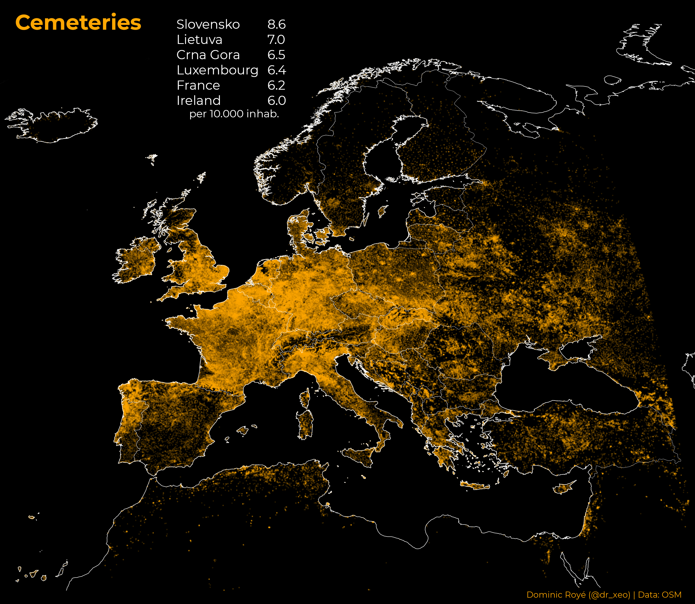

- [dr_xeo](https://twitter.com/dr_xeo) - [link](https://twitter.com/dr_xeo/status/1322900054970163200)
- [_anirudhgovind](https://twitter.com/_anirudhgovind) - [link](https://twitter.com/_anirudhgovind/status/1322621799096483840)
- [balt_ti](https://twitter.com/balt_ti) - [link](https://twitter.com/balt_ti/status/1322824722405597184)
- [giurugg](https://twitter.com/giurugg) - [link](https://twitter.com/giurugg/status/1322855600263409667)
- [geodatascience](https://twitter.com/geodatascience) - [link](https://twitter.com/geodatascience/status/1322870996894961664) - [code](https://github.com/CaitHRobinson/beltandroad)
- [afrimapr](https://twitter.com/afrimapr) - [link](https://twitter.com/afrimapr/status/1322906394580996099)
- [mirzacengic](https://twitter.com/mirzacengic) - [link](https://twitter.com/mirzacengic/status/1322959665085452290)
- [dickoah](https://twitter.com/dickoah) - [link](https://twitter.com/dickoah/status/1322996652542668800)
- [jmatics](https://twitter.com/jmatics) - [link](https://twitter.com/jmatics/status/1323017743969472512)
- [nurussadad](https://twitter.com/nurussadad) - [link](https://twitter.com/nurussadad/status/1323054269851824129)
- [Super_Explorer](https://twitter.com/Super_Explorer) - [link](https://twitter.com/Super_Explorer/status/1323092527029886978)
- [valen_ibiza](https://twitter.com/valen_ibiza) - [link](https://twitter.com/valen_ibiza/status/1323020336535883777)
- [rgeomatic](https://twitter.com/rgeomatic) - [link](https://twitter.com/rgeomatic/status/1323206126482132992)
- [topographos2](https://twitter.com/topographos2) - [link](https://twitter.com/topographos2/status/1323249563927535629)
- [sporella](https://twitter.com/sporella) - [link](https://twitter.com/sporella/status/1323381205581123591) - [code](https://github.com/sporella/30daymap/blob/master/1_points.R)
- [bus_jus](https://twitter.com/bus_jus) - [link](https://twitter.com/bus_jus/status/1323507776937582592)
- [JakubPacocha](https://twitter.com/JakubPacocha) - [link](https://twitter.com/JakubPacocha/status/1267883771216498690)
- [lxndrkp](https://twitter.com/lxndrkp) - [link](https://twitter.com/lxndrkp/status/1322836184821833728)

## Day 2

2020-11-02 - Lines - *A map with lines*

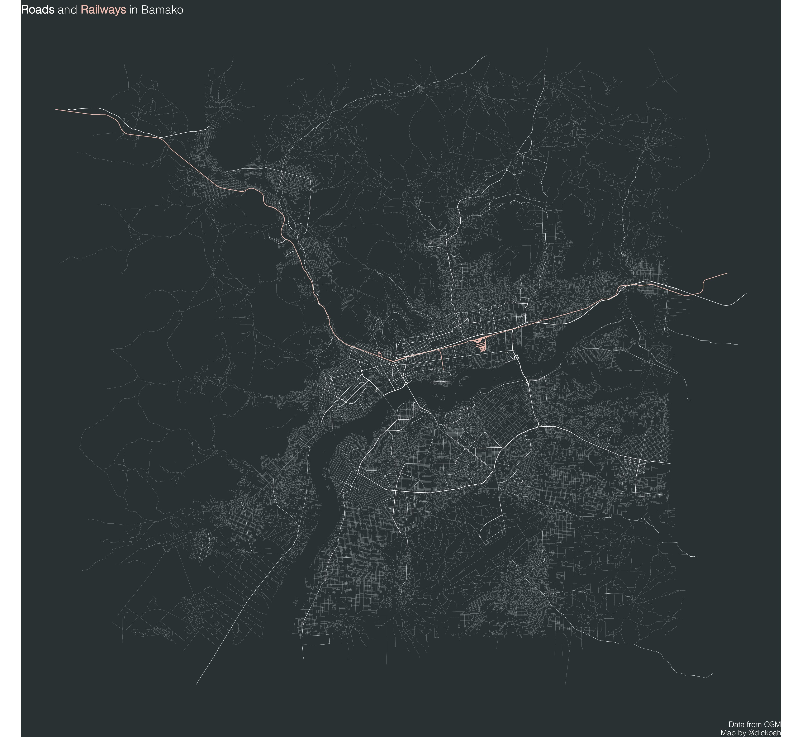

- [dickoah](https://twitter.com/dickoah) - [link](https://twitter.com/dickoah/status/1323198013863546880)
- [valen_ibiza](https://twitter.com/valen_ibiza) - [link](https://twitter.com/valen_ibiza/status/1323236534481489920)
- [nurussadad](https://twitter.com/nurussadad) - [link](https://twitter.com/nurussadad/status/1323195469401452544) - [code](https://rpubs.com/nurussadad/Lines-30DMC)
- [dr_xeo](https://twitter.com/dr_xeo) - [link](https://twitter.com/dr_xeo/status/1323215332425768960)
- [balt_ti](https://twitter.com/balt_ti) - [link](https://twitter.com/balt_ti/status/1323106208430149632)
- [rgeomatic](https://twitter.com/rgeomatic) - [link](https://twitter.com/rgeomatic/status/1323184726530732032)
- [lemuscanovas](https://twitter.com/lemuscanovas) - [link](https://twitter.com/rgeomatic/status/1323211962466078721)
- [geodatascience](https://twitter.com/geodatascience) - [link](https://twitter.com/geodatascience/status/1323233395783196672)
- [cstats1](https://twitter.com/cstats1) - [link](https://twitter.com/cstats1/status/1323256819523923971)
- [jmatics](https://twitter.com/jmatics) - [link](https://twitter.com/jmatics/status/1323291994920263681)
- [mirzacengic](https://twitter.com/mirzacengic) - [link](https://twitter.com/mirzacengic/status/1323350008687714304)
- [sporella](https://twitter.com/sporella) - [link](https://twitter.com/sporella/status/1323398149382307840) - [code](https://github.com/sporella/30daymap/blob/master/2_lines.R)
- [Super_Explorer](https://twitter.com/Super_Explorer) - [link](https://twitter.com/Super_Explorer/status/1323451337875574786)
- [chinmay_deval](https://twitter.com/chinmay_deval) - [link](https://twitter.com/chinmay_deval/status/1323463146443431937)
- [topographos2](https://twitter.com/topographos2) - [link](https://twitter.com/topographos2/status/1323563495275847681)
- [lxndrkp](https://twitter.com/lxndrkp) - [link](https://twitter.com/lxndrkp/status/1323166665195048965)

## Day 3

2020-11-03 - Polygons - *A map with polygons*

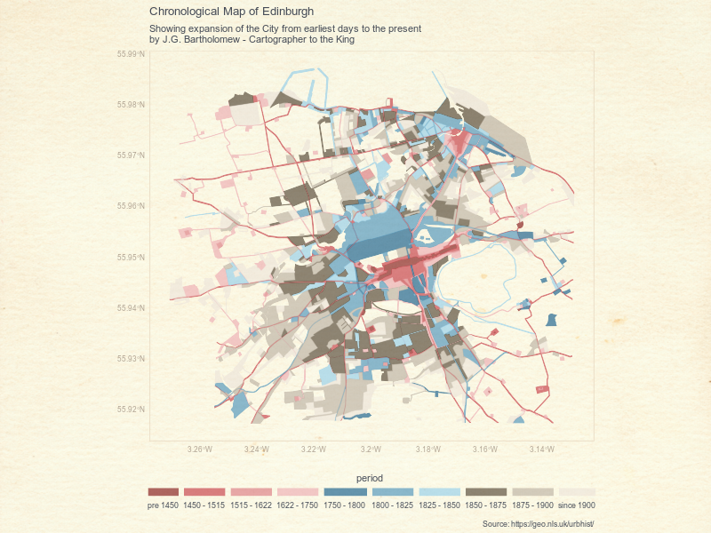

- [topographos2](https://twitter.com/topographos2) - [link](https://twitter.com/topographos2/status/1323730609055977472)
- [nurussadad](https://twitter.com/nurussadad) - [link](https://twitter.com/nurussadad/status/1323403859918684160) - [code](https://rpubs.com/nurussadad/Polygons-30DMC)
- [dr_xeo](https://twitter.com/dr_xeo) - [link](https://twitter.com/dr_xeo/status/1323549864249204736) - [code](https://dominicroye.github.io/en/2019/visualize-urban-growth/)
- [dickoah](https://twitter.com/dickoah) - [link](https://twitter.com/dickoah/status/1323578636033789954)
- [valen_ibiza](https://twitter.com/valen_ibiza) - [link](https://twitter.com/valen_ibiza/status/1323622223744278532)
- [rgeomatic](https://twitter.com/rgeomatic) - [link](https://twitter.com/rgeomatic/status/1323569878717108225) - [code](https://gist.github.com/rCarto/f7c6d7e621448a7d5a80ef789112628a)
- [afrimapr](https://twitter.com/afrimapr) - [link](https://twitter.com/afrimapr/status/1323620041217245186)
- [jmatics](https://twitter.com/jmatics) - [link](https://twitter.com/jmatics/status/1323644589593473025)
- [JohannesRahlf](https://twitter.com/JohannesRahlf) - [link](https://twitter.com/jmatics/status/1323705598672838660)
- [katiejolly6](https://twitter.com/katiejolly6) - [link](https://twitter.com/katiejolly6/status/1323712903401283584) - [code](https://github.com/katiejolly/30-day-maps-2020/blob/main/03-polygons/03-polygons-single-family.R)
- [sporella](https://twitter.com/sporella) - [link](https://twitter.com/sporella/status/1323734045688254470) - [code](https://github.com/sporella/30daymap/blob/master/3_polygons.R)
- [Super_Explorer](https://twitter.com/Super_Explorer) - [link](https://twitter.com/Super_Explorer/status/1323739662213652482)
- [cstats1](https://twitter.com/cstats1) - [link](https://twitter.com/cstats1/status/1323793538769969159)
- [chinmay_deval](https://twitter.com/chinmay_deval) - [link](https://twitter.com/chinmay_deval/status/1323849176765984769)
- [giurugg](https://twitter.com/giurugg) - [link](https://twitter.com/giurugg/status/1324001783425961991)
- [lxndrkp](https://twitter.com/lxndrkp) - [link](https://twitter.com/lxndrkp/status/1323542606685548546)

## Day 4

2020-11-04 - Hexagons - *A map with hexagons*

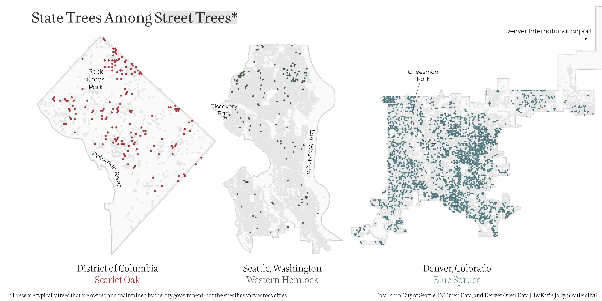

- [katiejolly6](https://twitter.com/katiejolly6) - [link](https://twitter.com/katiejolly6/status/1324201290159697921) - [code](https://github.com/katiejolly/30-day-maps-2020/blob/main/04-hexagons)
- [dickoah](https://twitter.com/dickoah) - [link](https://twitter.com/dickoah/status/1324054397421236231)
- [rgeomatic](https://twitter.com/rgeomatic) - [link](https://twitter.com/rgeomatic/status/1324269211758350337) - [code](https://gist.github.com/rCarto/e8ac1e67d4632c79362532af3f2492bf)
- [bus_jus](https://twitter.com/bus_jus) - [link](https://twitter.com/bus_jus/status/1324125270664597506)
- [cstats1](https://twitter.com/cstats1) - [link](https://twitter.com/cstats1/status/1324114711516950529)
- [sporella](https://twitter.com/sporella) - [link](https://twitter.com/sporella/status/1324105404780077056) - [code](https://github.com/sporella/30daymap/blob/master/4_hexagons.R)
- [FedericoTallis](https://twitter.com/FedericoTallis) - [code](https://twitter.com/FedericoTallis/status/1324066100246708233)
- [LuizGalizia](https://twitter.com/LuizGalizia) - [code](https://twitter.com/LuizGalizia/status/1324058141382893569)
- [dr_xeo](https://twitter.com/dr_xeo) - [link](https://twitter.com/dr_xeo/status/1324055479086174208)
- [footloose_nil](https://twitter.com/footloose_nil) - [link](https://twitter.com/footloose_nil/status/1324048292376961024)
- [afrimapr](https://twitter.com/afrimapr) - [link](https://twitter.com/afrimapr/status/1324038002696441856)
- [topographos2](https://twitter.com/topographos2) - [link](https://twitter.com/topographos2/status/1324035149248503812)
- [jmatics](https://twitter.com/jmatics) - [link](https://twitter.com/jmatics/status/1324011457684688897)
- [balt_ti](https://twitter.com/balt_ti) - [link](https://twitter.com/balt_ti/status/1323856948551438336)
- [_anirudhgovind](https://twitter.com/_anirudhgovind) - [link](https://twitter.com/_anirudhgovind/status/1323827200869629952)
- [geomigr](https://twitter.com/geomigr) - [link](https://twitter.com/geomigr/status/1323980607668523010)
- [JakubPacocha](https://twitter.com/JakubPacocha) - [link](https://twitter.com/JakubPacocha/status/1324333778815361032?s=20)
- [Super_Explorer](https://twitter.com/Super_Explorer) - [link](https://twitter.com/Super_Explorer/status/1324084996190199809)
- [lxndrkp](https://twitter.com/lxndrkp) - [link](https://twitter.com/lxndrkp/status/1323892285956870145)

## Day 5

2020-11-05 - Blue - *A map with blue colour or a map about something blue*

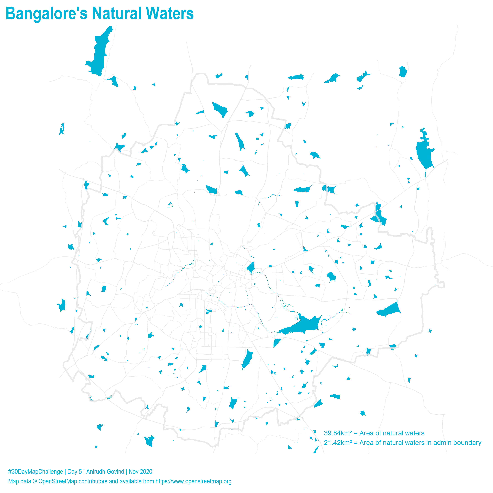

- [_anirudhgovind](https://twitter.com/_anirudhgovind) - [link](https://twitter.com/_anirudhgovind/status/1324403935503769600)
- [dickoah](https://twitter.com/dickoah) - [link](https://twitter.com/dickoah/status/1324358054570303488)
- [Super_Explorer](https://twitter.com/Super_Explorer) - [link](https://twitter.com/Super_Explorer/status/1324540122340204545)
- [sporella](https://twitter.com/sporella) - [link](https://twitter.com/sporella/status/1324412750697799681) - [code](https://github.com/sporella/30daymap/blob/master/5_blue.R)
- [balt_ti](https://twitter.com/balt_ti) - [link](https://twitter.com/balt_ti/status/1324238914325012480)
- [rgeomatic](https://twitter.com/rgeomatic) - [link](https://twitter.com/rgeomatic/status/1324269850705993730)
- [footloose_nil](https://twitter.com/footloose_nil) - [link](https://twitter.com/footloose_nil/status/1324391390042796033)
- [joeroe90](https://twitter.com/joeroe90) - [link](https://twitter.com/joeroe90/status/1324450847259086854)
- [jmatics](https://twitter.com/jmatics) - [link](https://twitter.com/jmatics/status/1324485492805718016)
- [katiejolly6](https://twitter.com/katiejolly6) - [link](https://twitter.com/katiejolly6/status/1324536306735616000)
- [chinmay_deval](https://twitter.com/chinmay_deval) - [link](https://twitter.com/chinmay_deval/status/1324556541987483648)
- [bus_jus](https://twitter.com/bus_jus) - [link](https://twitter.com/bus_jus/status/1324563244485279744)
- [dr_xeo](https://twitter.com/dr_xeo) - [link](https://twitter.com/dr_xeo/status/1324668175913492483)
- [topographos2](https://twitter.com/topographos2) - [link](https://twitter.com/topographos2/status/1325198692698058755)

## Day 6

2020-11-06 - Red - *A map with red colour or a map about something red*

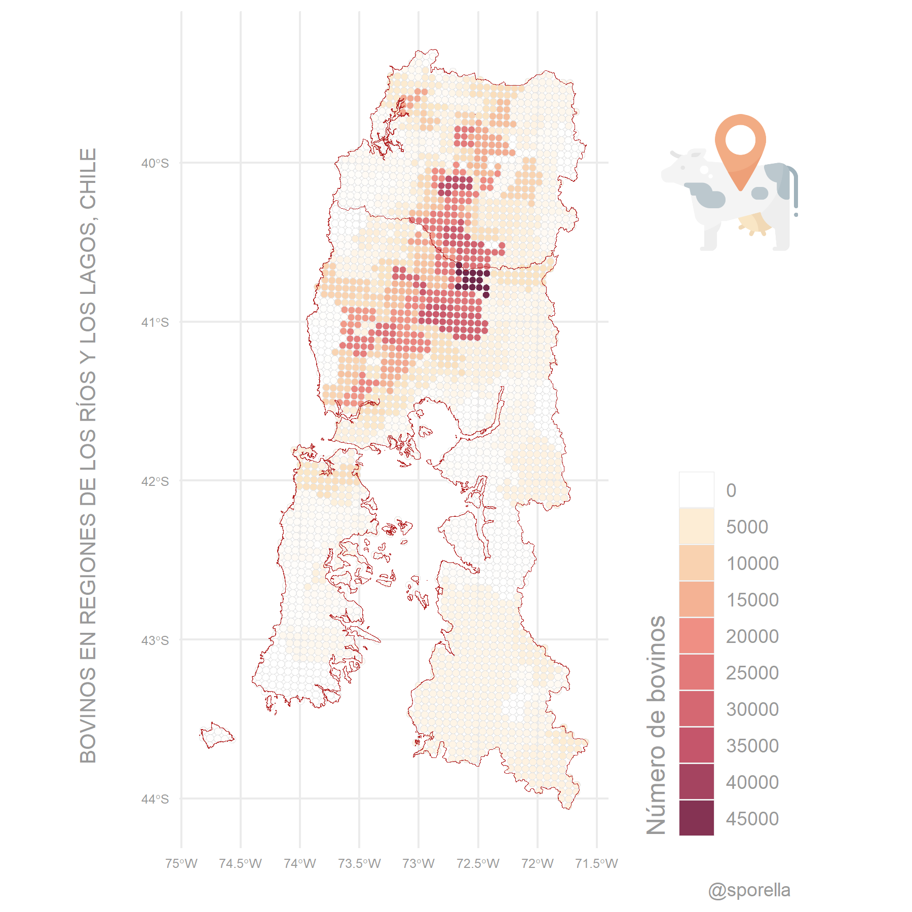

- [sporella](https://twitter.com/sporella) - [link](https://twitter.com/sporella/status/1324842999927300096) - [code](https://github.com/sporella/30daymap/blob/master/6_red.R)
- [dickoah](https://twitter.com/dickoah) - [link](https://twitter.com/dickoah/status/1324724156982824960)
- [rgeomatic](https://twitter.com/rgeomatic) - [link](https://twitter.com/rgeomatic/status/1324651903838572544)
- [balt_ti](https://twitter.com/balt_ti) - [link](https://twitter.com/balt_ti/status/1324674544334966787)
- [footloose_nil](https://twitter.com/footloose_nil) - [link](https://twitter.com/footloose_nil/status/1324772073395421184)
- [jmatics](https://twitter.com/jmatics) - [link](https://twitter.com/jmatics/status/1324813307853836289)
- [cstats1](https://twitter.com/cstats1) - [link](https://twitter.com/cstats1/status/1324917244921606146)
- [bus_jus](https://twitter.com/bus_jus) - [link](https://twitter.com/bus_jus/status/1324924630872645632)
- [Super_Explorer](https://twitter.com/Super_Explorer) - [link](https://twitter.com/Super_Explorer/status/1324940562110308352)
- [topographos2](https://twitter.com/topographos2) - [link](https://twitter.com/topographos2/status/1325198699031650304)
- [chinmay_deval](https://twitter.com/chinmay_deval) - [link](https://twitter.com/chinmay_deval/status/1325320675817525248)
- [dr_xeo](https://twitter.com/dr_xeo) - [link](https://twitter.com/dr_xeo/status/1325383333702983680)
- [lxndrkp](https://twitter.com/lxndrkp) - [link](https://twitter.com/lxndrkp/status/1324623758217367556)

## Day 7

2020-11-07 - Green - *A map with green colour or a map about something green*

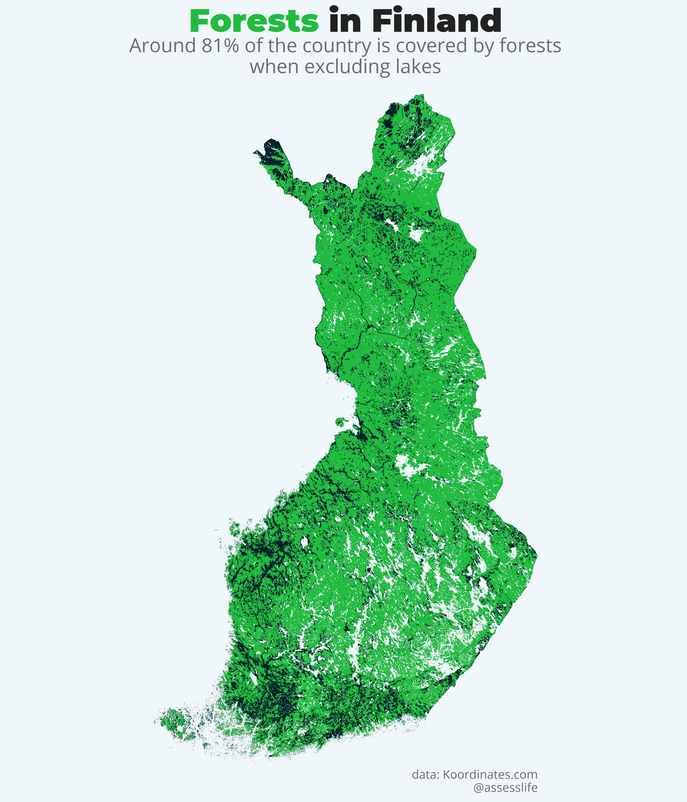

- [assesslife](https://twitter.com/assesslife) - [link](https://twitter.com/assesslife/status/1324947388528726016)
- [balt_ti](https://twitter.com/balt_ti) - [link](https://twitter.com/balt_ti/status/1324818932566499329)
- [footloose_nil](https://twitter.com/footloose_nil) - [link](https://twitter.com/footloose_nil/status/1325075795556130816)
- [_anirudhgovind](https://twitter.com/_anirudhgovind) - [link](https://twitter.com/_anirudhgovind/status/1325075920760180738)
- [dickoah](https://twitter.com/dickoah) - [link](https://twitter.com/dickoah/status/1325097102507208705)
- [dr_xeo](https://twitter.com/dr_xeo) - [link](https://twitter.com/dr_xeo/status/1325117071089410048)
- [jmatics](https://twitter.com/jmatics) - [link](https://twitter.com/jmatics/status/1325141688252133380)
- [topographos2](https://twitter.com/topographos2) - [link](https://twitter.com/topographos2/status/1325198704735907845)
- [sporella](https://twitter.com/sporella) - [link](https://twitter.com/sporella/status/1325202367990562817)
- [chinmay_deval](https://twitter.com/chinmay_deval) - [link](https://twitter.com/chinmay_deval/status/1325320670780170247)
- [cstats1](https://twitter.com/cstats1) - [link](https://twitter.com/cstats1/status/1325665410105176064)
- [JonasStillhard](https://twitter.com/JonasStillhard) - [link](https://twitter.com/JonasStillhard/status/1325812864616108032)

## Day 8

2020-11-08 - Yellow - *A map with yellow colour or a map about something yellow*

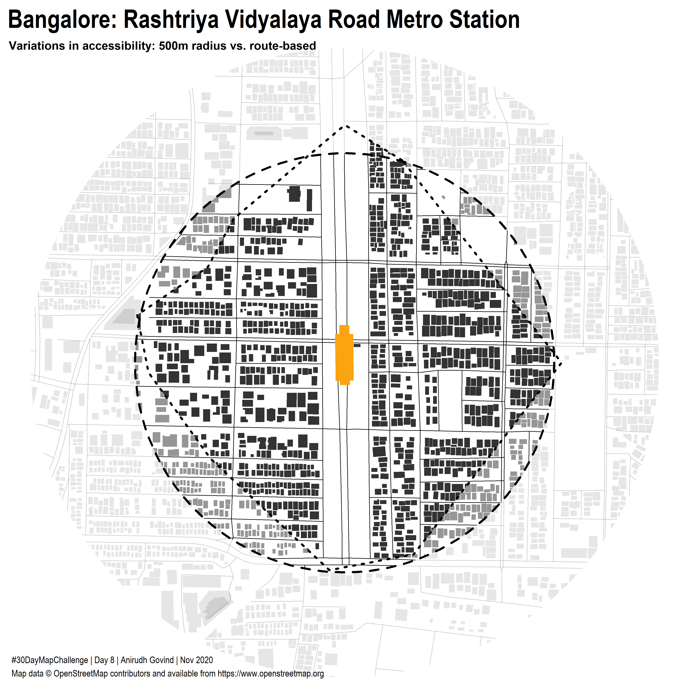

- [_anirudhgovind](https://twitter.com/_anirudhgovind) - [link](https://twitter.com/_anirudhgovind/status/1325175058541678593)
- [topographos2](https://twitter.com/topographos2) - [link](https://twitter.com/topographos2/status/1325198710746177536)
- [balt_ti](https://twitter.com/balt_ti) - [link](https://twitter.com/balt_ti/status/1325325033284243456)
- [dickoah](https://twitter.com/dickoah) - [link](https://twitter.com/dickoah/status/1325454941696176129)
- [footloose_nil](https://twitter.com/footloose_nil) - [link](https://twitter.com/footloose_nil/status/1325486204607983622)
- [_skuethe](https://twitter.com/_skuethe) - [link](https://twitter.com/_skuethe/status/1325503257272311813)
- [dr_xeo](https://twitter.com/dr_xeo) - [link](https://twitter.com/dr_xeo/status/1325508412474597378)
- [jmatics](https://twitter.com/jmatics) - [link](https://twitter.com/jmatics/status/1325545130665922561)
- [sporella](https://twitter.com/sporella) - [link](https://twitter.com/sporella/status/1325610759284461568)
- [Super_Explorer](https://twitter.com/Super_Explorer) - [link](https://twitter.com/Super_Explorer/status/1325621803172163584)
- [cstats1](https://twitter.com/cstats1) - [link](https://twitter.com/cstats1/status/1325666173451644928)
- [chinmay_deval](https://twitter.com/chinmay_deval) - [link](https://twitter.com/chinmay_deval/status/1325712999894589440)
- [JonasStillhard](https://twitter.com/JonasStillhard) - [link](https://twitter.com/JonasStillhard/status/1325813630479314944)
- [lxndrkp](https://twitter.com/lxndrkp) - [link](https://twitter.com/lxndrkp/status/1325411372629430278)

## Day 9

2020-11-09 - Monochrome - *A monochromic image is composed of one color (or values of one color). So for example black and white maps are valid here. [See some inspiration from the great monochrome mapping competition](https://somethingaboutmaps.wordpress.com/monocarto-2019-winners/) (although those masterpieces took a bit more than a day to make, probably).*

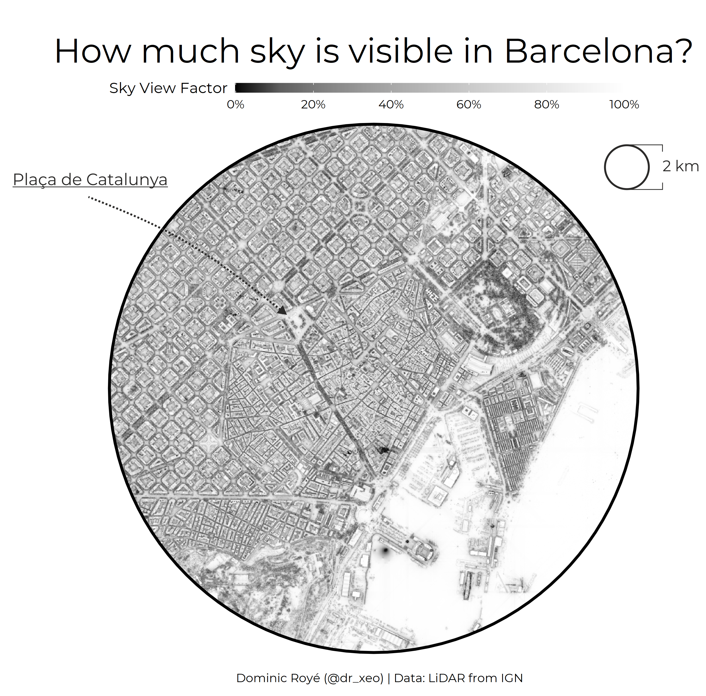

- [lxndrkp](https://twitter.com/lxndrkp) - [link](https://twitter.com/lxndrkp/status/1325727846145413122)
- [balt_ti](https://twitter.com/balt_ti) - [link](https://twitter.com/balt_ti/status/1325631088513970177)
- [assesslife](https://twitter.com/assesslife) - [link](https://twitter.com/assesslife/status/1325678691368783872)
- [BjnNowak](https://twitter.com/BjnNowak) - [link](https://twitter.com/BjnNowak/status/1325689034073665541)
- [dickoah](https://twitter.com/dickoah) - [link](https://twitter.com/dickoah/status/1325744014910480385)
- [LuizGalizia](https://twitter.com/LuizGalizia) - [link](https://twitter.com/LuizGalizia/status/1325762816519905281)
- [JonasStillhard](https://twitter.com/JonasStillhard) - [link](https://twitter.com/JonasStillhard/status/1325815240907513856)
- [footloose_nil](https://twitter.com/footloose_nil) - [link](https://twitter.com/footloose_nil/status/1325847793752281092)
- [_skuethe](https://twitter.com/_skuethe) - [link](https://twitter.com/_skuethe/status/1325850672139530240)
- [jmatics](https://twitter.com/jmatics) - [link](https://twitter.com/jmatics/status/1325852402398994432)
- [_anirudhgovind](https://twitter.com/_anirudhgovind) - [link](https://twitter.com/_anirudhgovind/status/1325854398069628928)
- [sporella](https://twitter.com/sporella) - [link](https://twitter.com/sporella/status/1325950276445024256)
- [chinmay_deval](https://twitter.com/chinmay_deval) - [link](https://twitter.com/chinmay_deval/status/1326037386535395329)
- [katiejolly6](https://twitter.com/katiejolly6) - [link](https://twitter.com/katiejolly6/status/1326232875075710976)

## Day 10

2020-11-19 - Grid - *Whether you call it a grid or a fishnet, the idea is to visualize something in a grid form*

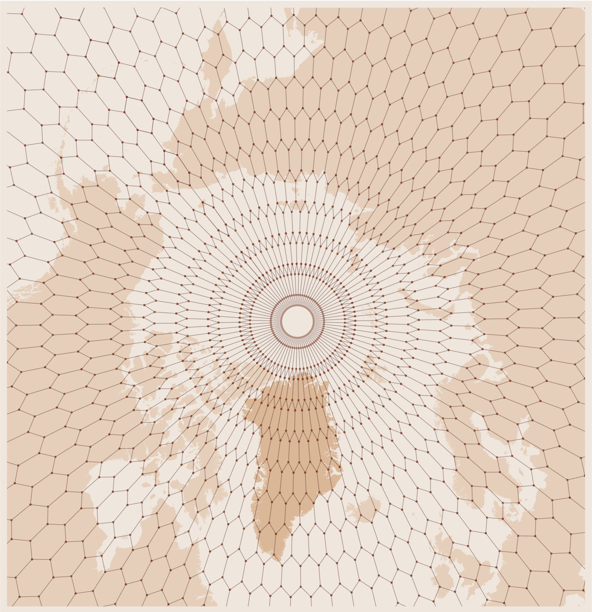

- [emilmalta](https://twitter.com/emilmalta) - [link](https://twitter.com/emilmalta/status/1326089036935684096)
- [chinmay_deval](https://twitter.com/chinmay_deval) - [link](https://twitter.com/chinmay_deval/status/1326432163294752770)
- [Super_Explorer](https://twitter.com/Super_Explorer) - [link](https://twitter.com/Super_Explorer/status/1326383450388111363)
- [JonasStillhard](https://twitter.com/JonasStillhard) - [link](https://twitter.com/JonasStillhard/status/1326259807544815619)
- [GrrdJul](https://twitter.com/GrrdJul) - [link](https://twitter.com/GrrdJul/status/1326246858944114689)
- [dr_xeo](https://twitter.com/dr_xeo) - [link](https://twitter.com/dr_xeo/status/1326229292523659266)
- [footloose_nil](https://twitter.com/footloose_nil) - [link](https://twitter.com/footloose_nil/status/1326219744702312457)
- [jmatics](https://twitter.com/jmatics) - [link](https://twitter.com/jmatics/status/1326214976411996161)
- [_skuethe](https://twitter.com/_skuethe) - [link](https://twitter.com/_skuethe/status/1326177628227850240)
- [_anirudhgovind](https://twitter.com/_anirudhgovind) - [link](https://twitter.com/_anirudhgovind/status/1326160494160347137)
- [BjnNowak](https://twitter.com/BjnNowak) - [link](https://twitter.com/BjnNowak/status/1326040106654969857)
- [balt_ti](https://twitter.com/balt_ti) - [link](https://twitter.com/balt_ti/status/1325998807306416128)
- [lxndrkp](https://twitter.com/lxndrkp) - [link](https://twitter.com/lxndrkp/status/1326103266506182656)
- [darwinanddavis](https://twitter.com/darwinanddavis) - [link](https://twitter.com/darwinanddavis/status/1326479238434709504)
- [sporella](https://twitter.com/sporella) - [link](https://twitter.com/sporella/status/1326290538073567233)

## Day 11

2020-11-11 - 3D - *The magnificent third dimension! Visualize something in 3D*

- [cstats1](https://twitter.com/cstats1) - [link](https://twitter.com/cstats1/status/1326571601765216257)
- [LuizGalizia](https://twitter.com/LuizGalizia) - [link](https://twitter.com/LuizGalizia/status/1326796976713818113)
- [darwinanddavis](https://twitter.com/darwinanddavis) - [link](https://twitter.com/darwinanddavis/status/1326785178606374912)
- [Super_Explorer](https://twitter.com/Super_Explorer) - [link](https://twitter.com/Super_Explorer/status/1326739251350949891)
- [PratapVardhan](https://twitter.com/PratapVardhan) - [link](https://twitter.com/PratapVardhan/status/1326723456449253379)
- [emilmalta](https://twitter.com/emilmalta) - [link](https://twitter.com/emilmalta/status/1326701516766502912)
- [dickoah](https://twitter.com/dickoah) - [link](https://twitter.com/dickoah/status/1326648011737460739)
- [sporella](https://twitter.com/sporella) - [link](https://twitter.com/sporella/status/1326601947789586432)
- [_anirudhgovind](https://twitter.com/_anirudhgovind) - [link](https://twitter.com/_anirudhgovind/status/1326584025306304514)
- [footloose_nil](https://twitter.com/footloose_nil) - [link](https://twitter.com/footloose_nil/status/1326578195014033408)
- [_skuethe](https://twitter.com/_skuethe) - [link](https://twitter.com/_skuethe/status/1326563185047035904)
- [TheRealJimShady](https://twitter.com/TheRealJimShady) - [link](https://twitter.com/TheRealJimShady/status/1326530304161558529)
- [topographos2](https://twitter.com/topographos2) - [link](https://twitter.com/topographos2/status/1326495648229842946)
- [JonasStillhard](https://twitter.com/JonasStillhard) - [link](https://twitter.com/JonasStillhard/status/1326481553359319042)
- [geomigr](https://twitter.com/geomigr) - [link](https://twitter.com/geomigr/status/1326473536446357504)
- [dr_xeo](https://twitter.com/dr_xeo) - [link](https://twitter.com/dr_xeo/status/1326447924067364865)
- [balt_ti](https://twitter.com/balt_ti) - [link](https://twitter.com/balt_ti/status/1326392718310957057)
- [BjnNowak](https://twitter.com/BjnNowak) - [link](https://twitter.com/BjnNowak/status/1326386178527031303)

## Day 12

2020-11-12 - Map not made with GIS software - *Can be anything from hand-drawn to a map made with excel or ASCII. So get out your pen and paper or go crazy*

## Day 13

2020-11-13 - Raster - *Nothing stops you from doing almost all of the maps with raster data. But this day is dedicated to those lovely pixels*

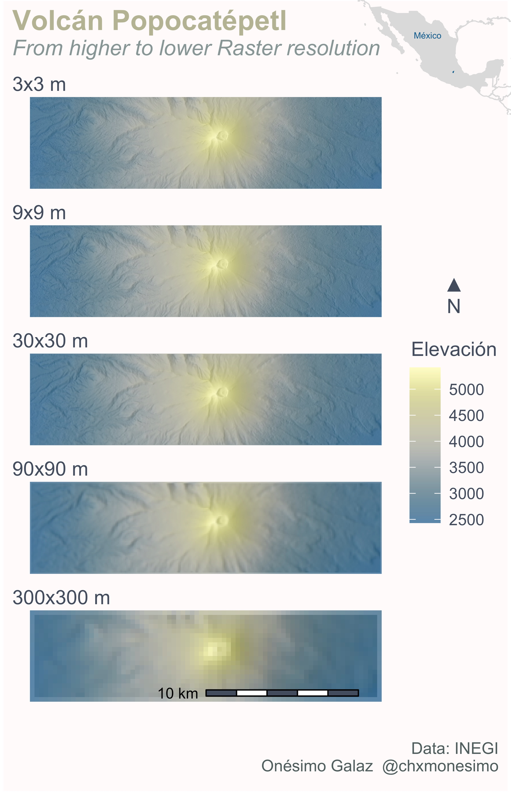

- [chxmonesimo](https://twitter.com/chxmonesimo) - [link](https://twitter.com/chxmonesimo/status/1327429879311200256)
- [dr_xeo](https://twitter.com/dr_xeo) - [link](https://twitter.com/dr_xeo/status/1327180310220509186)
- [balt_ti](https://twitter.com/balt_ti) - [link](https://twitter.com/balt_ti/status/1327194930775805952)
- [JonasStillhard](https://twitter.com/JonasStillhard) - [link](https://twitter.com/JonasStillhard/status/1327206283943047169)
- [TheRealJimShady](https://twitter.com/TheRealJimShady) - [link](https://twitter.com/TheRealJimShady/status/1327229770250280970)
- [_anirudhgovind](https://twitter.com/_anirudhgovind) - [link](https://twitter.com/_anirudhgovind/status/1327315479006908416)
- [footloose_nil](https://twitter.com/footloose_nil) - [link](https://twitter.com/footloose_nil/status/1327315480537862144)
- [_skuethe](https://twitter.com/_skuethe) - [link](https://twitter.com/_skuethe/status/1327327184579678210)
- [sporella](https://twitter.com/sporella) - [link](https://twitter.com/sporella/status/1327392899890257921)
- [JuvenalCamposF](https://twitter.com/JuvenalCamposF) - [link](https://twitter.com/JuvenalCamposF/status/1327447732953309184)
- [ldcgodoy](https://twitter.com/ldcgodoy) - [link](https://twitter.com/ldcgodoy/status/1327462181806469120)
- [dickoah](https://twitter.com/dickoah) - [link](https://twitter.com/dickoah/status/1327893707765526533)
- [cstats1](https://twitter.com/cstats1) - [link](https://twitter.com/cstats1/status/1327839973073104901)

## Day 14

2020-11-14 - Climate change - *Climate change is one of the biggest challenges of our time and the spatial community has an important role to communicate this*

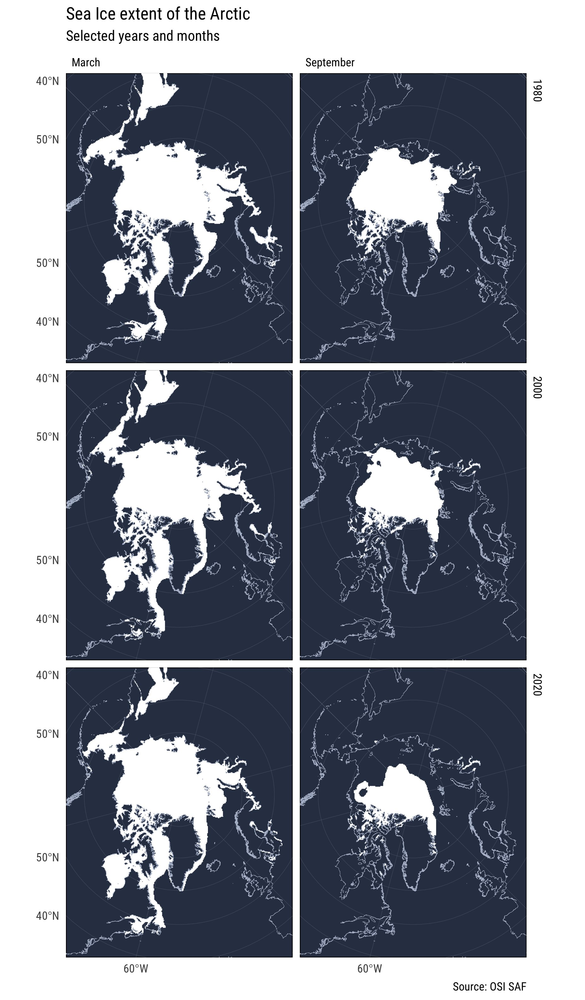

- [emilmalta](https://twitter.com/emilmalta) - [link](https://twitter.com/emilmalta/status/1327700161024421891)
- [dickoah](https://twitter.com/dickoah) - [link](https://twitter.com/dickoah/status/1327894595569655815)
- [_skuethe](https://twitter.com/_skuethe) - [link](https://twitter.com/_skuethe/status/1327684360288546819)
- [footloose_nil](https://twitter.com/footloose_nil) - [link](https://twitter.com/footloose_nil/status/1327642976156311554)
- [dr_xeo](https://twitter.com/dr_xeo) - [link](https://twitter.com/dr_xeo/status/1327570352063598594)
- [sporella](https://twitter.com/sporella) - [link](https://twitter.com/sporella/status/1327731699489312768)
- [_anirudhgovind](https://twitter.com/_anirudhgovind) - [link](https://twitter.com/_anirudhgovind/status/1327674809631666176)
- [Kenneth_KHW](https://twitter.com/Kenneth_KHW) - [link](https://twitter.com/Kenneth_KHW/status/1327618222154153985)
- [balt_ti](https://twitter.com/balt_ti) - [link](https://twitter.com/balt_ti/status/1327518982014980096)
- [JanPhilippKolb](https://twitter.com/JanPhilippKolb) - [link](https://twitter.com/JanPhilippKolb/status/1328048879128940550)
- [darwinanddavis](https://twitter.com/darwinanddavis) - [link](https://twitter.com/darwinanddavis/status/1328325435755696130)
- [cstats1](https://twitter.com/cstats1) - [link](https://twitter.com/cstats1/status/1328459429575094273)

## Day 15

2020-11-15 - Connections - *Connections between something*

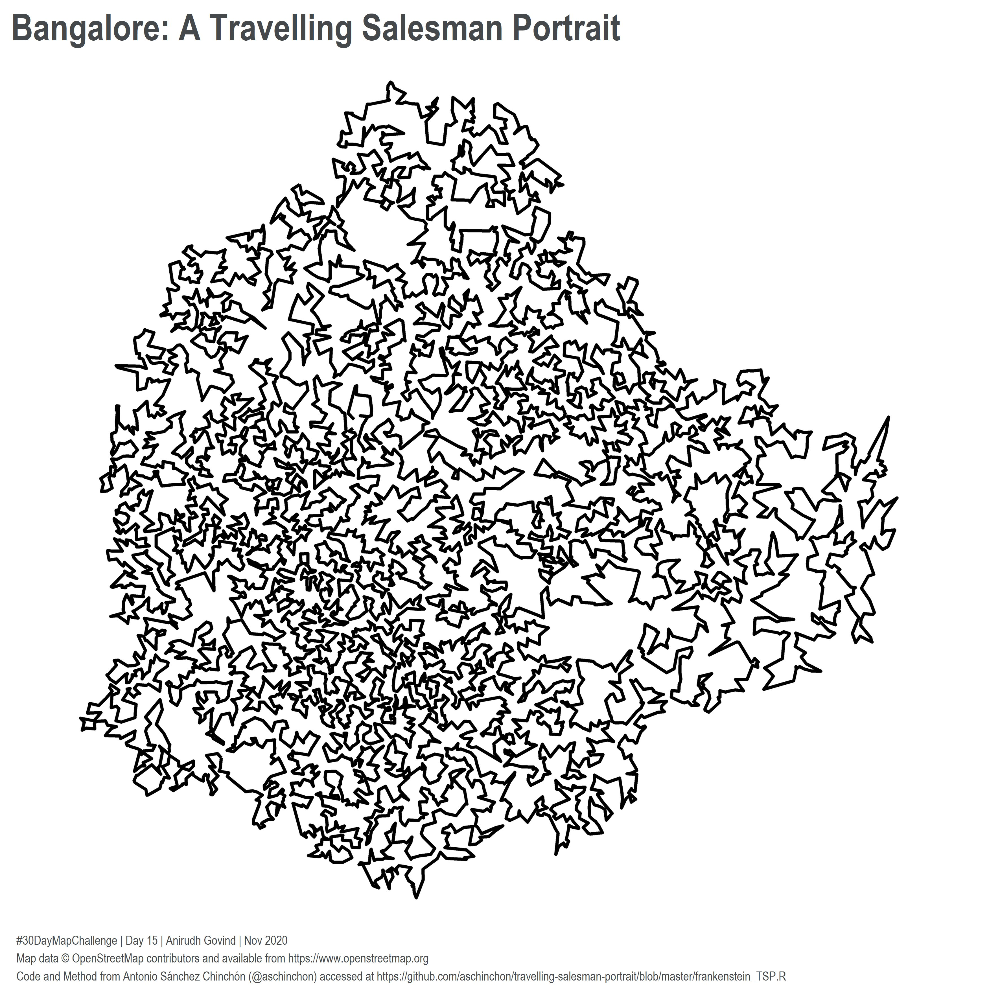

- [_anirudhgovind](https://twitter.com/_anirudhgovind) - [link](https://twitter.com/_anirudhgovind/status/1328042891508289541)
- [balt_ti](https://twitter.com/balt_ti) - [link](https://twitter.com/balt_ti/status/1327906437574569985)
- [dr_xeo](https://twitter.com/dr_xeo) - [link](https://twitter.com/dr_xeo/status/1327914852061487105)
- [JonasStillhard](https://twitter.com/JonasStillhard) - [link](https://twitter.com/JonasStillhard/status/1327935650977419264)
- [dickoah](https://twitter.com/dickoah) - [link](https://twitter.com/dickoah/status/1328027566779854848)
- [footloose_nil](https://twitter.com/footloose_nil) - [link](https://twitter.com/footloose_nil/status/1328028194751066112)
- [JanPhilippKolb](https://twitter.com/JanPhilippKolb) - [link](https://twitter.com/JanPhilippKolb/status/1328069399417413633)
- [sporella](https://twitter.com/sporella) - [link](https://twitter.com/sporella/status/1328099709240557568)
- [PratapVardhan](https://twitter.com/PratapVardhan) - [link](https://twitter.com/PratapVardhan/status/1328179697998565381)
- [cstats1](https://twitter.com/cstats1) - [link](https://twitter.com/cstats1/status/1328463815101526018)

## Day 16

2020-11-16 - Island(s) - *Islands tend to look quite beautiful on maps. Could be also something else than physical islands*

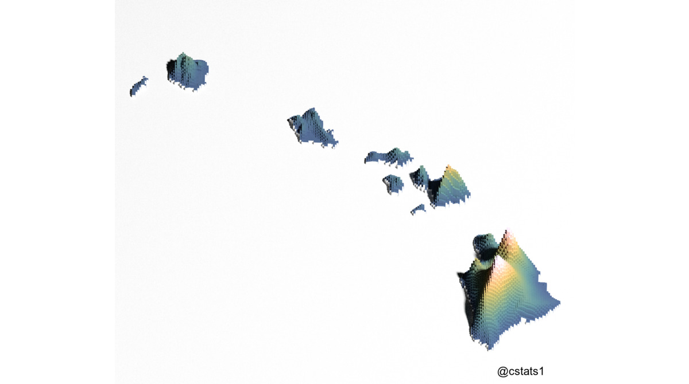

- [cstats1](https://twitter.com/cstats1) - [link](https://twitter.com/cstats1/status/1328561594469584896)
- [balt_ti](https://twitter.com/balt_ti) - [link](https://twitter.com/balt_ti/status/1328176651302211584)
- [PratapVardhan](https://twitter.com/PratapVardhan) - [link](https://twitter.com/PratapVardhan/status/1328534768250736640)
- [geodatascience](https://twitter.com/geodatascience) - [link](https://twitter.com/geodatascience/status/1328301050399485954)
- [JonasStillhard](https://twitter.com/JonasStillhard) - [link](https://twitter.com/JonasStillhard/status/1328334310496235523)
- [JanPhilippKolb](https://twitter.com/JanPhilippKolb) - [link](https://twitter.com/JanPhilippKolb/status/1328368126334033920)
- [_anirudhgovind](https://twitter.com/_anirudhgovind) - [link](https://twitter.com/_anirudhgovind/status/1328392802674176001)
- [footloose_nil](https://twitter.com/footloose_nil) - [link](https://twitter.com/footloose_nil/status/1328401373453377536)
- [sporella](https://twitter.com/sporella) - [link](https://twitter.com/sporella/status/1328482720549310464)

## Day 17

2020-11-17 - Historical map - *Historical data, historical map style or something else*

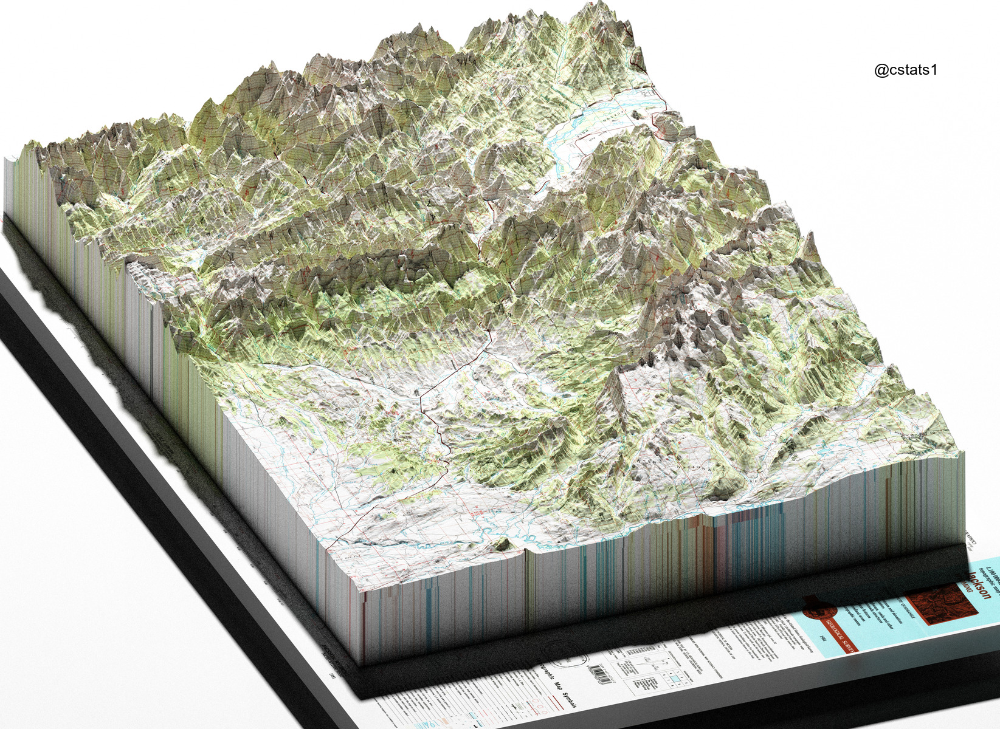

- [cstats1](https://twitter.com/cstats1) - [link](https://twitter.com/cstats1/status/1328876581356494849)
- [balt_ti](https://twitter.com/balt_ti) - [link](https://twitter.com/balt_ti/status/1328531876731031553)
- [BjnNowak](https://twitter.com/BjnNowak) - [link](https://twitter.com/BjnNowak/status/1328571008224276483)
- [JonasStillhard](https://twitter.com/JonasStillhard) - [link](https://twitter.com/JonasStillhard/status/1328619971023343617)
- [giurugg](https://twitter.com/giurugg) - [link](https://twitter.com/giurugg/status/1328741559576223746)
- [_anirudhgovind](https://twitter.com/_anirudhgovind) - [link](https://twitter.com/_anirudhgovind/status/1328744562135691270)
- [footloose_nil](https://twitter.com/footloose_nil) - [link](https://twitter.com/footloose_nil/status/1328764534392238081)
- [JanPhilippKolb](https://twitter.com/JanPhilippKolb) - [link](https://twitter.com/JanPhilippKolb/status/1328783185421987840)
- [dickoah](https://twitter.com/dickoah) - [link](https://twitter.com/dickoah/status/1328792572802838529)
- [cstats1](https://twitter.com/cstats1) - [link](https://twitter.com/cstats1/status/1328874094008348678)
- [sporella](https://twitter.com/sporella) - [link](https://twitter.com/sporella/status/1329008447120084996)

## Day 18

2020-11-18 - Landuse - *How land is used, within a city, region, country or continent? How has it changed?*

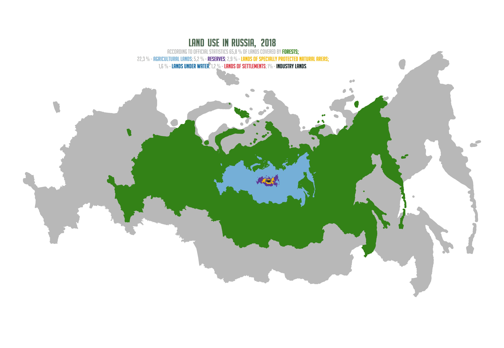

- [balt_ti](https://twitter.com/balt_ti) - [link](https://twitter.com/balt_ti/status/1328904653237575681)
- [BjnNowak](https://twitter.com/BjnNowak) - [link](https://twitter.com/BjnNowak/status/1328933100739579917)
- [BjnNowak](https://twitter.com/BjnNowak) - [link](https://twitter.com/BjnNowak/status/1329002209682599939)
- [geodatascience](https://twitter.com/geodatascience) - [link](https://twitter.com/geodatascience/status/1329029905150070785)
- [dr_xeo](https://twitter.com/dr_xeo) - [link](https://twitter.com/dr_xeo/status/1329010369830981632)
- [_anirudhgovind](https://twitter.com/_anirudhgovind) - [link](https://twitter.com/_anirudhgovind/status/1329122166739144705)
- [footloose_nil](https://twitter.com/footloose_nil) - [link](https://twitter.com/footloose_nil/status/1329148853245923336)
- [JanPhilippKolb](https://twitter.com/JanPhilippKolb) - [link](https://twitter.com/JanPhilippKolb/status/1329149628944617472)
- [sporella](https://twitter.com/sporella) - [link](https://twitter.com/sporella/status/1329365047324282880)
- [JonasStillhard](https://twitter.com/JonasStillhard) - [link](https://twitter.com/JonasStillhard/status/1329420068124569600)
- [dickoah](https://twitter.com/dickoah) - [link](https://twitter.com/dickoah/status/1329890438845788160)
- [Shel_Kariuki](https://twitter.com/Shel_Kariuki) - [link](https://twitter.com/Shel_Kariuki/status/1330161363809923076)

## Day 19

2020-11-19 - NULL - *Missing data. We all hate that, right? How to map something that is missing?*

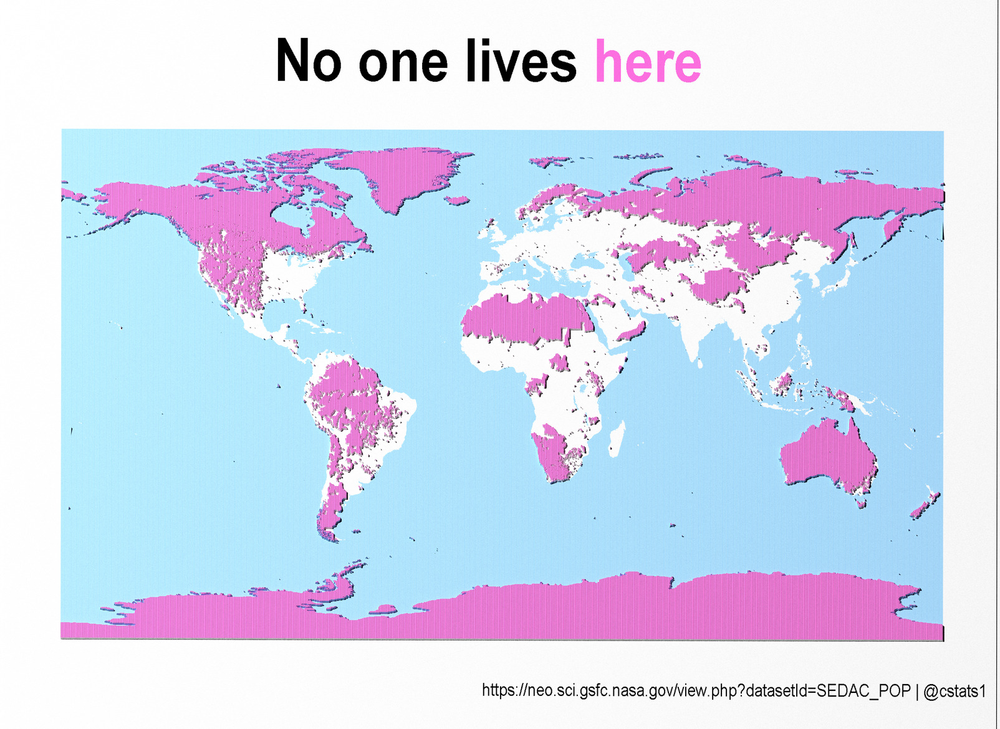

- [cstats1](https://twitter.com/cstats1) - [link](https://twitter.com/cstats1/status/1329410849648291846)
- [JonasStillhard](https://twitter.com/JonasStillhard) - [link](https://twitter.com/JonasStillhard/status/1329420434190835713)
- [_anirudhgovind](https://twitter.com/_anirudhgovind) - [link](https://twitter.com/_anirudhgovind/status/1329469458654478336)
- [JanPhilippKolb](https://twitter.com/JanPhilippKolb) - [link](https://twitter.com/JanPhilippKolb/status/1329502505244516354)
- [sporella](https://twitter.com/sporella) - [link](https://twitter.com/sporella/status/1329554169011843073)
- [vanhorssenpeter](https://twitter.com/vanhorssenpeter) - [link](https://twitter.com/vanhorssenpeter/status/1329789895079055362)

## Day 20

2020-11-20 - Population - *That is you and me. A classic theme for thematic maps*

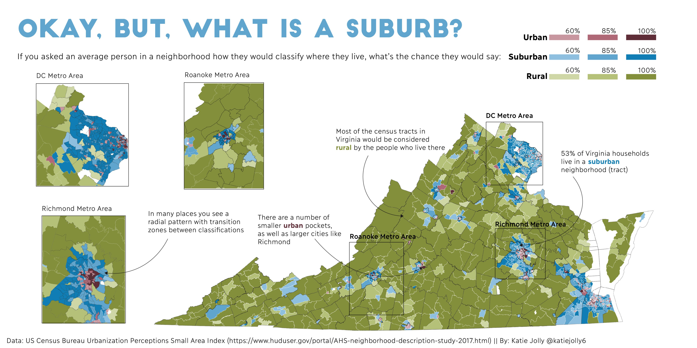

- [katiejolly6](https://twitter.com/katiejolly6) - [link](https://twitter.com/katiejolly6/status/1329961209861443587)
- [balt_ti](https://twitter.com/balt_ti) - [link](https://twitter.com/balt_ti/status/1329623517051179010)
- [BjnNowak](https://twitter.com/BjnNowak) - [link](https://twitter.com/BjnNowak/status/1329654511275749376)
- [JonasStillhard](https://twitter.com/JonasStillhard) - [link](https://twitter.com/JonasStillhard/status/1329682857808293889)
- [Elio_Javi](https://twitter.com/Elio_Javi) - [link](https://twitter.com/Elio_Javi/status/1329707728311365634)
- [_anirudhgovind](https://twitter.com/_anirudhgovind) - [link](https://twitter.com/_anirudhgovind/status/1329832559841185792)
- [cstats1](https://twitter.com/cstats1) - [link](https://twitter.com/cstats1/status/1329834987189923840)
- [footloose_nil](https://twitter.com/footloose_nil) - [link](https://twitter.com/footloose_nil/status/1329835953062600711)
- [dickoah](https://twitter.com/dickoah) - [link](https://twitter.com/dickoah/status/1329891045866418178)
- [emilmalta](https://twitter.com/emilmalta) - [link](https://twitter.com/emilmalta/status/1329913699398787073)
- [sporella](https://twitter.com/sporella) - [link](https://twitter.com/sporella/status/1329924769110765572)
- [PratapVardhan](https://twitter.com/PratapVardhan) - [link](https://twitter.com/PratapVardhan/status/1330009424577110016)
- [JanPhilippKolb](https://twitter.com/JanPhilippKolb) - [link](https://twitter.com/JanPhilippKolb/status/1330245191962415112)
- [darwinanddavis](https://twitter.com/darwinanddavis) - [link](https://twitter.com/darwinanddavis/status/1330271869161836548)
- [lxndrkp](https://twitter.com/lxndrkp) - [link](https://twitter.com/lxndrkp/status/1329706477536342016)

## Day 21

2020-11-21 - Water - *Oceans, lakes, rivers or something completely different*

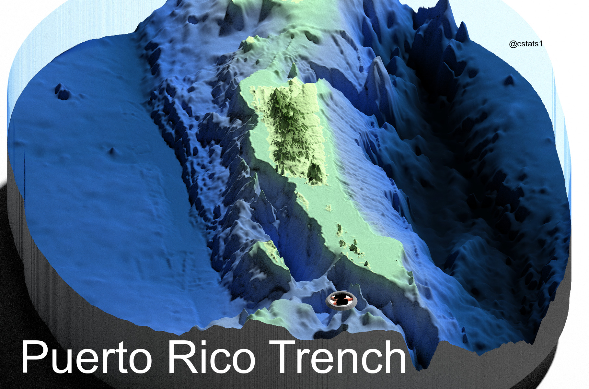

- [cstats1](https://twitter.com/cstats1) - [link](https://twitter.com/cstats1/status/1330010838091124736)
- [balt_ti](https://twitter.com/balt_ti) - [link](https://twitter.com/balt_ti/status/1330089907721809921)
- [JonasStillhard](https://twitter.com/JonasStillhard) - [link](https://twitter.com/JonasStillhard/status/1330176304004689922)
- [footloose_nil](https://twitter.com/footloose_nil) - [link](https://twitter.com/footloose_nil/status/1330209746280976384)
- [_anirudhgovind](https://twitter.com/_anirudhgovind) - [link](https://twitter.com/_anirudhgovind/status/1330216625023365121)
- [JanPhilippKolb](https://twitter.com/JanPhilippKolb) - [link](https://twitter.com/JanPhilippKolb/status/1330248611263885323)
- [dr_xeo](https://twitter.com/dr_xeo) - [link](https://twitter.com/dr_xeo/status/1330071950635511809)
- [dickoah](https://twitter.com/dickoah) - [link](https://twitter.com/dickoah/status/1330188678757560322)
- [sporella](https://twitter.com/sporella) - [link](https://twitter.com/sporella/status/1330301262198427649)
- [Shel_Kariuki](https://twitter.com/Shel_Kariuki) - [link](https://twitter.com/Shel_Kariuki/status/1330567671801401350)
- [assesslife](https://twitter.com/assesslife) - [link](https://twitter.com/assesslife/status/1330056980422123523)
- [geokaramanis](https://twitter.com/geokaramanis) - [link](https://twitter.com/geokaramanis/status/1330099021747277825)
- [JoshCopping](https://twitter.com/JoshCopping) - [link](https://twitter.com/JoshCopping/status/1330192393606410243)
- [Makeo88](https://twitter.com/Makeo88) - [link](https://twitter.com/Makeo88/status/1329924646452432896)

## Day 22

2020-11-22 - Movement - *Visualizing movement can be done with a static map or with an animation*

- [balt_ti](https://twitter.com/balt_ti) - [link](https://twitter.com/balt_ti/status/1330423566995755011)
- [dr_xeo](https://twitter.com/dr_xeo) - [link](https://twitter.com/dr_xeo/status/1330439584463921152)
- [LuizGalizia](https://twitter.com/LuizGalizia) - [link](https://twitter.com/LuizGalizia/status/1330478539393601537)
- [cstats1](https://twitter.com/cstats1) - [link](https://twitter.com/cstats1/status/1330495947319758856)
- [_anirudhgovind](https://twitter.com/_anirudhgovind) - [link](https://twitter.com/_anirudhgovind/status/1330501147782574081)
- [JonasStillhard](https://twitter.com/JonasStillhard) - [link](https://twitter.com/JonasStillhard/status/1330521930626117635)
- [footloose_nil](https://twitter.com/footloose_nil) - [link](https://twitter.com/footloose_nil/status/1330576446935404544)
- [dickoah](https://twitter.com/dickoah) - [link](https://twitter.com/dickoah/status/1330623761675120647)
- [emilmalta](https://twitter.com/emilmalta) - [link](https://twitter.com/emilmalta/status/1330633306170421252)
- [JanPhilippKolb](https://twitter.com/JanPhilippKolb) - [link](https://twitter.com/JanPhilippKolb/status/1330636507653271555)
- [sporella](https://twitter.com/sporella) - [link](https://twitter.com/sporella/status/1330815101788594178)
- [Mathieu Basille](https://twitter.com/MabLabUF) - [link1](https://twitter.com/MabLabUF/status/1330596722322583552) / [link2](https://twitter.com/MabLabUF/status/1330600304304418821)
- [lxndrkp](https://twitter.com/lxndrkp) - [link](https://twitter.com/lxndrkp/status/1330538849290883072)
- [JoshCopping](https://twitter.com/JoshCopping) - [link](https://twitter.com/JoshCopping/status/1330577633080389633)
- [MikeMahoney218](https://twitter.com/MikeMahoney218) - [link](https://twitter.com/MikeMahoney218/status/1330520158339645440)
- [datagistips](https://twitter.com/datagistips) - [link](https://twitter.com/datagistips/status/1330428014862213124)

## Day 23

2020-11-23 - Boundaries - *Boundaries are all around us. Some of them are visible and some of them are in our heads*

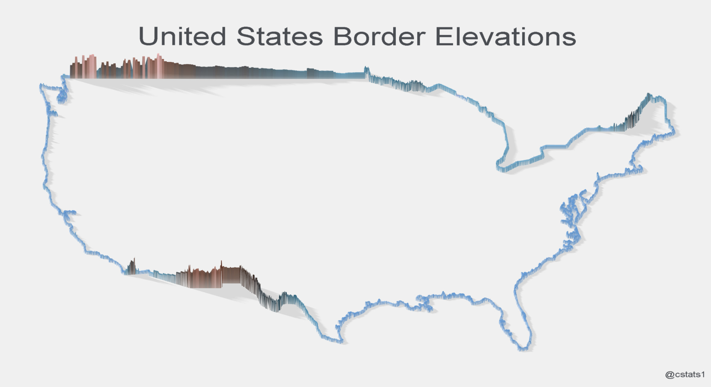

- [cstats1](https://twitter.com/cstats1) - [link](https://twitter.com/cstats1/status/1330997182116327425)
- [balt_ti](https://twitter.com/balt_ti) - [link](https://twitter.com/balt_ti/status/1330851504027299841)
- [JonasStillhard](https://twitter.com/JonasStillhard) - [link](https://twitter.com/JonasStillhard/status/1330887080566812673)
- [footloose_nil](https://twitter.com/footloose_nil) - [link](https://twitter.com/footloose_nil/status/1330905430101553158)
- [dr_xeo](https://twitter.com/dr_xeo) - [link](https://twitter.com/dr_xeo/status/1330929543746625540)
- [JanPhilippKolb](https://twitter.com/JanPhilippKolb) - [link](https://twitter.com/JanPhilippKolb/status/1330943606220349440)
- [dickoah](https://twitter.com/dickoah) - [link](https://twitter.com/dickoah/status/1330971837409398787)
- [sporella](https://twitter.com/sporella) - [link](https://twitter.com/sporella/status/1331025774401515520)
- [katiejolly6](https://twitter.com/katiejolly6) - [link](https://twitter.com/katiejolly6/status/1331065812938059776)
- [emilmalta](https://twitter.com/emilmalta) - [link](https://twitter.com/emilmalta/status/1331387111778496513)
- [darwinanddavis](https://twitter.com/darwinanddavis) - [link](https://twitter.com/darwinanddavis/status/1331628781488881664)
- [JoshCopping](https://twitter.com/JoshCopping) - [link](https://twitter.com/JoshCopping/status/1330959836910133251)
- [zentree](https://twitter.com/zentree) - [link](https://twitter.com/zentree/status/1330481155989254150)

## Day 24

2020-11-24 - Elevation - *Sweet hillshades, beautiful contours, high mountains or low valleys*

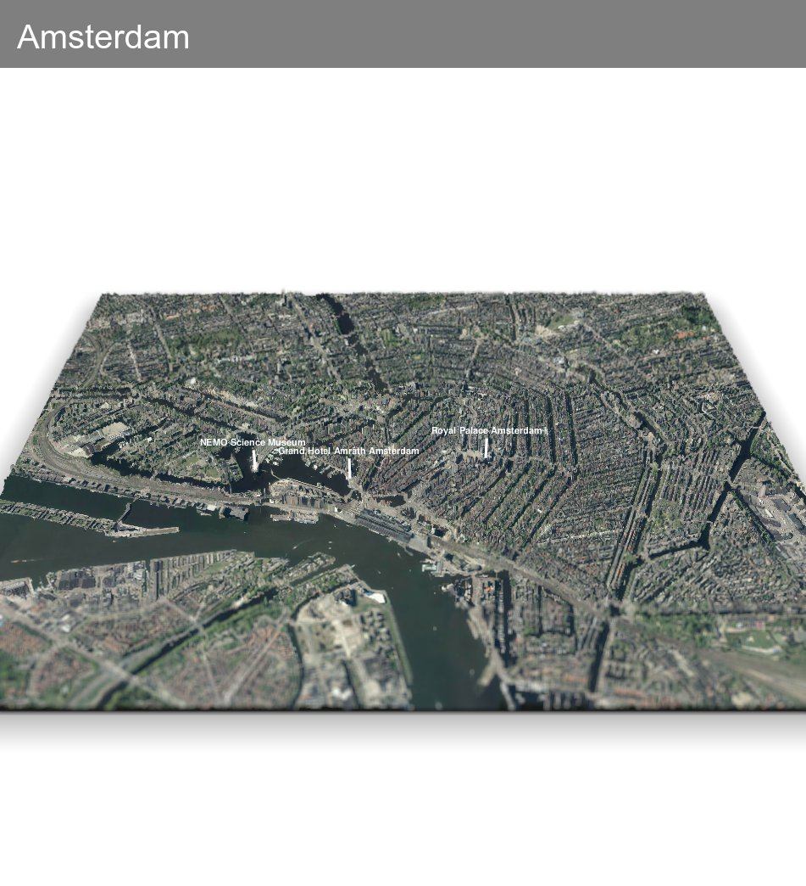

- [dickoah](https://twitter.com/dickoah) - [link](https://twitter.com/dickoah/status/1331379303385337856)
- [JanPhilippKolb](https://twitter.com/JanPhilippKolb) - [link](https://twitter.com/JanPhilippKolb/status/1331502079257534470)
- [PratapVardhan](https://twitter.com/PratapVardhan) - [link](https://twitter.com/PratapVardhan/status/1331445228423831552)
- [emilmalta](https://twitter.com/emilmalta) - [link](https://twitter.com/emilmalta/status/1331388099579039752)
- [balt_ti](https://twitter.com/balt_ti) - [link](https://twitter.com/balt_ti/status/1331075784983842824)
- [assesslife](https://twitter.com/assesslife) - [link](https://twitter.com/assesslife/status/1331105044658270208)
- [neocartocnrs](https://twitter.com/neocartocnrs) - [link](https://twitter.com/neocartocnrs/status/1331146558998523906)
- [JonasStillhard](https://twitter.com/JonasStillhard) - [link](https://twitter.com/JonasStillhard/status/1331224600848560130)
- [_anirudhgovind](https://twitter.com/_anirudhgovind) - [link](https://twitter.com/_anirudhgovind/status/1331284438462853120)
- [footloose_nil](https://twitter.com/footloose_nil) - [link](https://twitter.com/footloose_nil/status/1331297472661102599)
- [cstats1](https://twitter.com/cstats1) - [link](https://twitter.com/cstats1/status/1331365466128912385)
- [vivalosburros](https://twitter.com/vivalosburros) - [link](https://twitter.com/vivalosburros/status/1331378480114765827)
- [emilmalta](https://twitter.com/emilmalta) - [link](https://twitter.com/emilmalta/status/1331388099579039752)
- [dr_xeo](https://twitter.com/dr_xeo) - [link](https://twitter.com/dr_xeo/status/1331900311024398336)
- [andymacmeister1](https://twitter.com/andymacmeister1) - [link](https://twitter.com/andymacmeister1/status/1331582734003789824)
- [sporella](https://twitter.com/sporella) - [link](https://twitter.com/sporella/status/1331757365637636098)
- [Makeo88](https://twitter.com/Makeo88) - [link](https://twitter.com/Makeo88/status/1331452253375328258)
- [MikeMahoney218](https://twitter.com/MikeMahoney218) - [link](https://twitter.com/MikeMahoney218/status/1331239397677678592)
- [MrNSheehan](https://twitter.com/MrNSheehan) - [link](https://twitter.com/MrNSheehan/status/1331200340859957252)
- [geodatascience](https://twitter.com/geodatascience) - [link](https://twitter.com/geodatascience/status/1331199031889039360)

## Day 25

2020-11-25 - COVID-19 - *It’s 2020 and I’m just as fed up with COVID-19 as you are, but just can’t skip this theme this year. Check [this blog post](https://www.esri.com/arcgis-blog/products/product/mapping/mapping-coronavirus-responsibly/) for some tips*

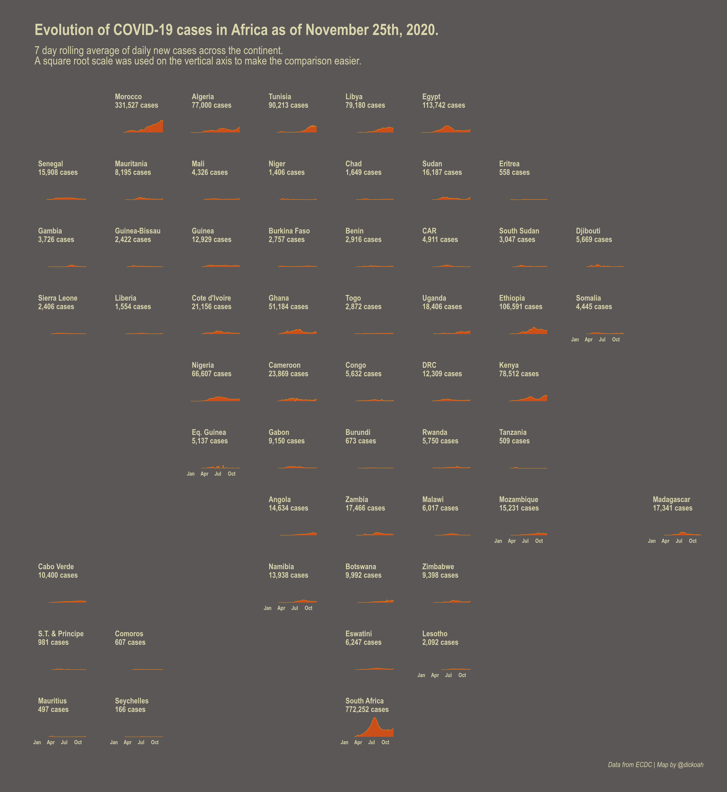

- [dickoah](https://twitter.com/dickoah) - [link](https://twitter.com/dickoah/status/1331739329044078593)
- [JonasStillhard](https://twitter.com/JonasStillhard) - [link](https://twitter.com/JonasStillhard/status/1331515902618193920)
- [neocartocnrs](https://twitter.com/neocartocnrs) - [link](https://twitter.com/neocartocnrs/status/1331516242960789507)
- [chxmonesimo](https://twitter.com/chxmonesimo) - [link](https://twitter.com/chxmonesimo/status/1331522879658233857)
- [footloose_nil](https://twitter.com/footloose_nil) - [link](https://twitter.com/footloose_nil/status/1331616304751587330)
- [JonasStillhard](https://twitter.com/JonasStillhard) - [link](https://twitter.com/JonasStillhard/status/1331631697004269569)
- [sporella](https://twitter.com/sporella) - [link](https://twitter.com/sporella/status/1332048588516560902)
- [darwinanddavis](https://twitter.com/darwinanddavis) - [link](https://twitter.com/darwinanddavis/status/1331886065334927360)
- [emilmalta](https://twitter.com/emilmalta) - [link](https://twitter.com/emilmalta/status/1331957934029479937)

## Day 26

2020-11-26 - Map with a new tool - *As the whole challenge is much about learning and experimenting, this day is dedicated to exploring new tools*

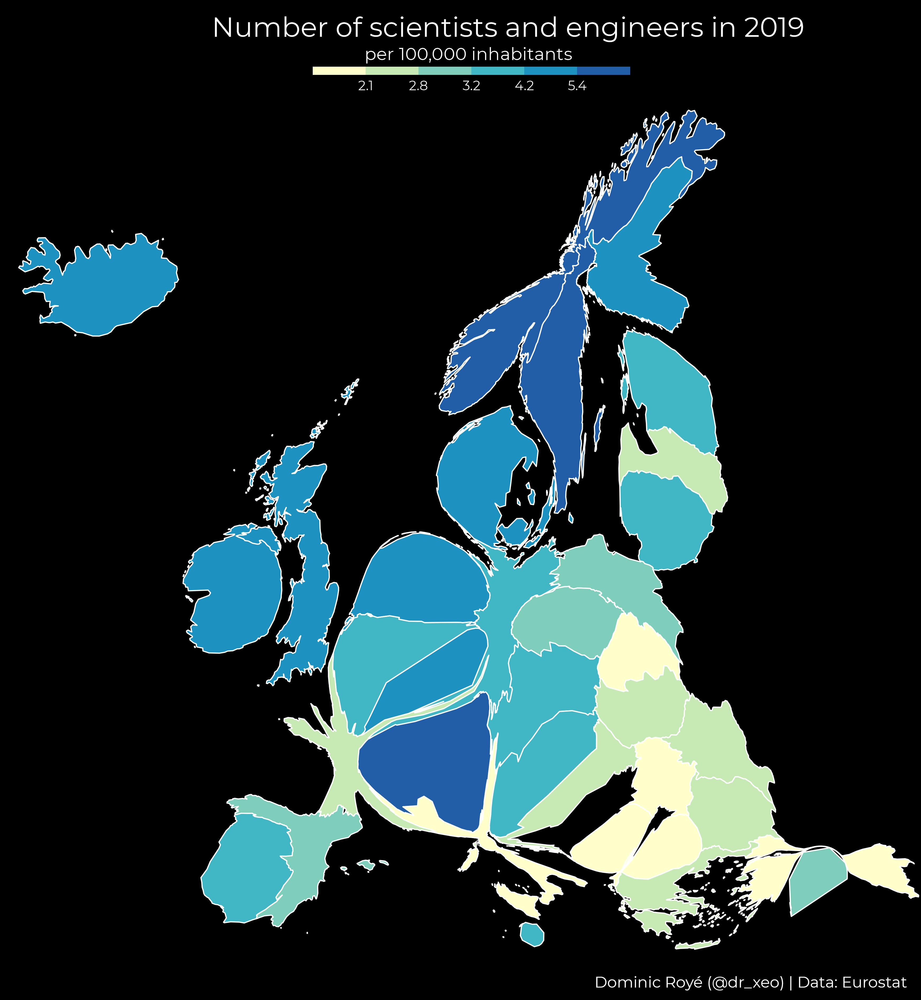

- [dr_xeo](https://twitter.com/dr_xeo) - [link](https://twitter.com/dr_xeo/status/1332652724740100096)
- [_anirudhgovind](https://twitter.com/_anirudhgovind) - [link](https://twitter.com/_anirudhgovind/status/1332023844777857025)
- [JanPhilippKolb](https://twitter.com/JanPhilippKolb) - [link](https://twitter.com/JanPhilippKolb/status/1331938517052743680)
- [MikeMahoney218](https://twitter.com/MikeMahoney218) - [link](https://twitter.com/MikeMahoney218/status/1331968954902982656)

## Day 27

2020-11-27 - Big or small data - *What is meaningful big spatial data? What kind of spatial data is small but interesting?*

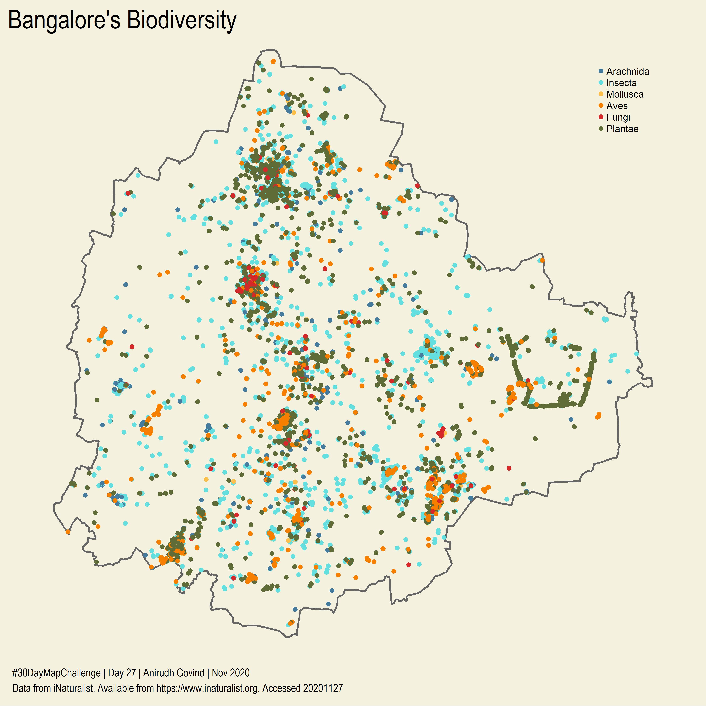

- [_anirudhgovind](https://twitter.com/_anirudhgovind) - [link](https://twitter.com/_anirudhgovind/status/1332369748462497792)
- [sporella](https://twitter.com/sporella) - [link](https://twitter.com/sporella/status/1332452390180704258)
- [afrimapr](https://twitter.com/afrimapr) - [link](https://twitter.com/afrimapr/status/1332284210430750721)
- [JonasStillhard](https://twitter.com/JonasStillhard) - [link](https://twitter.com/JonasStillhard/status/1332266976773861382)
- [dickoah](https://twitter.com/dickoah) - [link](https://twitter.com/dickoah/status/1332685734906630144)
- [zentree](https://twitter.com/zentree) - [link](https://twitter.com/zentree/status/1332274165835984898)
- [JanPhilippKolb](https://twitter.com/JanPhilippKolb) - [link](https://twitter.com/JanPhilippKolb/status/1332379755413385219)

## Day 28

2020-11-28 - Non-geographic map - *Topological maps, maps about planets, microscopic bacteria mapped or maybe even something weirder*

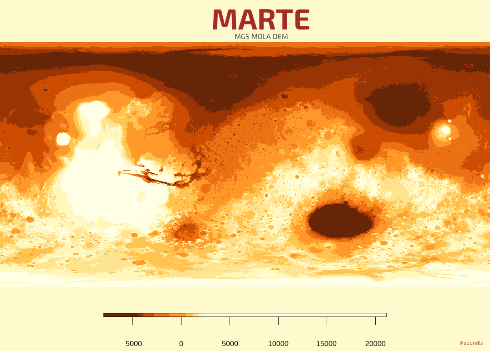

- [sporella](https://twitter.com/sporella) - [link](https://twitter.com/sporella/status/1332792129211469830)
- [_anirudhgovind](https://twitter.com/_anirudhgovind) - [link](https://twitter.com/_anirudhgovind/status/1332730487601729536)
- [dickoah](https://twitter.com/dickoah) - [link](https://twitter.com/dickoah/status/1333059175757328389)
- [JanPhilippKolb](https://twitter.com/JanPhilippKolb) - [link](https://twitter.com/JanPhilippKolb/status/1332943799518191617)
- [JonasStillhard](https://twitter.com/JonasStillhard) - [link](https://twitter.com/JonasStillhard/status/1332765843231551491)
- [balt_ti](https://twitter.com/balt_ti) - [link](https://twitter.com/balt_ti/status/1332684307786305545)

## Day 29

2020-11-29 - Globe - *The world isn’t flat, so with this map you can emphase the roundness of our planet*

## Day 30

2020-11-30 - A map - *No rules. You've made it this far, so do what you want. Just make a map*
